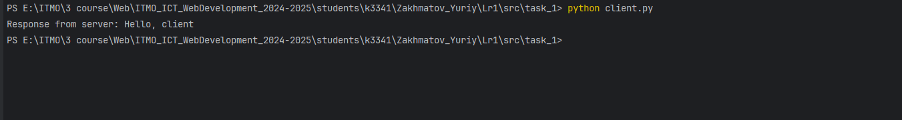

# Лабораторная работа №1
<b>Выполнил:</b> Захматов Юрий Дмитриевич

<b>Группа:</b> K3341 

---

## Задание 1:

---
<b>Содержание:</b> Реализовать клиентскую и серверную часть приложения. Клиент отправляет серверу сообщение «Hello, server», и оно должно отобразиться на стороне сервера. В ответ сервер отправляет клиенту сообщение «Hello, client», которое должно отобразиться у клиента.

<b>Требования:</b> Обязательно использовать библиотеку socket.
Реализовать с помощью протокола UDP.

---
<b>Выполнение: </b>

1. Создаем скрипт для сервера: 
~~~python
import socket

def run():
    # Создание UDP сокета
    server_socket = socket.socket(socket.AF_INET, socket.SOCK_DGRAM)

    # Задаем параметры
    server_address = ("localhost", 8080)
    server_socket.bind(server_address)

    print(f"Server started on {server_address[0]}:{server_address[1]}")
    print("Awaiting connection...")

    try:
        while True:
            # Получаем запрос клиента

            data, client_address = server_socket.recvfrom(1024)
            message = data.decode("utf-8")

            print(f"Received message from {client_address} : {message}")

            # отправляем ответ клиенту
            response = "Hello, client"
            server_socket.sendto(response.encode("utf-8"), client_address)
            print(f"Sent response to {client_address}")
    except Exception:
        print("\nServer shutting down...")
    finally:
        server_socket.close()

if __name__ == "__main__":
    run()
~~~
---
2. Создаем скрипт для клиента
~~~python
import socket

def run():
    #Создаем сокет для клиента UDP
    client_socket = socket.socket(socket.AF_INET, socket.SOCK_DGRAM)

    try:
        #Подключаемся к сокету
        client_socket.connect(('localhost', 8080))

        #Отправляем сообщение
        client_socket.sendall(b'Hello, server')

        #Получаем ответ
        response = client_socket.recv(1024)
        print(f"Response from server: {response.decode('utf-8')}")
    except Exception as e:
        print(e)
    finally:
        client_socket.close()

if __name__ == '__main__':
    run()
~~~
---
3. Запускаем сервер

---
4. Запускаем скрипт

---
5. Скрин с сервера

## Задание 2:

---
<b>Содержание:</b> Реализовать клиентскую и серверную часть приложения. Клиент запрашивает выполнение математической операции, параметры которой вводятся с клавиатуры. Сервер обрабатывает данные и возвращает результат клиенту.

<b>Требования:</b> Обязательно использовать библиотеку socket.
Реализовать с помощью протокола TCP.

<b>Вариант: </b> 8 (Поиск площади параллелограмма)

---
<b>Выполнение: </b>

1. Создаем скрипт для сервера
~~~python
import socket

def calculate(base, height):
    return base * height

def run():
    # Создание TCP сокета
    server_socket = socket.socket(socket.AF_INET, socket.SOCK_STREAM)

    # Задаем параметры
    server_address = ("localhost", 8080)
    server_socket.bind(server_address)
    server_socket.listen(1)

    print(f"Server started on {server_address[0]}:{server_address[1]}")
    print("Awaiting connection...")

    while True:
        # Принимаем подключение клиента
        client_socket, addr = server_socket.accept()

        print(f"Connected by: {addr}")

        try:
            # Получаем данные от клиента
            data = client_socket.recv(1024).decode("utf-8")
            print(f"Received data: {data}")

            # Преобразуем данные
            base, height = map(float, data.split(","))

            # Считаем
            area = calculate(base,height)

            # Отправляем данные
            client_socket.send(str(area).encode("utf-8"))

            print(f"Sent result to client: {area}")

        except Exception as e:
            error_msg = f"Error: {e}"
            client_socket.send(error_msg.encode("utf-8"))
            print(error_msg)

        finally:
            client_socket.close()

if __name__ == "__main__":
    run()
~~~
---
2. Создаем скрипт для клиента
~~~python
import socket

def run():
    client_socket = socket.socket(socket.AF_INET, socket.SOCK_STREAM)
    client_socket.connect(('localhost', 8080))

    try:
        base = float(input("Введите основание параллелограмма: "))
        height = float(input("Введите высоту параллелограмма: "))

        data = f"{base},{height}"
        client_socket.send(data.encode('utf-8'))

        result = client_socket.recv(1024).decode('utf-8')
        print(f"Площадь параллелограмма: {result}")

    except Exception as e:
        print(f"Ошибка: {e}")

    finally:
        client_socket.close()

if __name__ == "__main__":
    run()
~~~
---
3. Лог сервера (клиент запускался 2 раза)
---
4. Лог клиента

## Задание 3:

---
<b>Содержание:</b> Реализовать серверную часть приложения. Клиент подключается к серверу, и в ответ получает HTTP-сообщение, содержащее HTML-страницу, которая сервер подгружает из файла index.html

<b>Требования:</b> Обязательно использовать библиотеку socket.

---
<b>Выполнение: </b>

1. Создаем скрипт для сервера
~~~python
import os
import socket

HOST = "localhost"
PORT = 8080
MAX_CONNECTIONS = 3
BUFFER_SIZE = 1024

def load_html_file(filename):
    if os.path.exists(filename):
        with open(filename, 'r', encoding="utf-8") as file:
            return file.read()
    else:
        return None

def run():
    server = socket.socket(socket.AF_INET, socket.SOCK_STREAM)
    server.bind((HOST, PORT))
    server.listen(MAX_CONNECTIONS)
    print("Server is running on http://localhost:8080")

    while True:
        client, _ = server.accept()
        client.recv(BUFFER_SIZE)

        html = load_html_file("index.html")
        if html is not None:
            html_bytes = html.encode("utf-8")
            response = (
                        "HTTP/1.1 200 OK\r\n"
                        "Content-Type: text/html; charset=utf-8\r\n"
                        f"Content-Length: {len(html_bytes)}\r\n"
                        "\r\n"

            ).encode('utf-8') + html_bytes
        else:
            response = (
                "HTTP/1.1 404 Not Found\r\n"
                "Content-Type: text/html; charset=utf-8\r\n"
                "\r\n"
                "<h1>404 Not Found</h1>"
            ).encode('utf-8')
        client.sendall(response)
        client.close()

if __name__ == "__main__":
    run()
~~~
---
2. Проверяем что все работает

## Задание 4

---
<b>Содержание:</b> Реализовать многопользовательский чат. Для максимального количества баллов реализуйте многопользовательский чат.

<b>Требования:</b> Обязательно использовать библиотеку socket.
Для многопользовательского чата необходимо использовать библиотеку threading.

---
<b>Выполнение: </b>

1. Скрипт сервера
~~~python
import socket
import threading

HOST = 'localhost'
PORT = 8080

class ChatServer:
    def __init__(self, host=HOST, port=PORT):
        self.host = host
        self.port = port
        self.clients = [] # Кто подключен
        self.nicknames = [] # Никнеймы
        self.server_socket = socket.socket(socket.AF_INET, socket.SOCK_STREAM)

    def broadcast(self, message, sender_client=None):
        """Отправка сообщения всем клиентам кроме отправителя"""
        for client in self.clients:
            if client != sender_client:
                try:
                    client.send(message)
                except:
                    # Если отправка не удалась, удаляем клиента
                    self.remove_client(client)

    def remove_client(self, client):
        """Удаление клиента из чата"""
        if client in self.clients:
            index = self.clients.index(client)
            self.clients.remove(client)
            nickname = self.nicknames[index]
            self.nicknames.remove(nickname)

            broadcast_message = f"{nickname} покинул чат!".encode('utf-8')
            self.broadcast(broadcast_message)
            print(f"{nickname} отключился")

    def handle_client(self, client):
        """Обработка сообщений от клиента"""
        while True:
            try:
                message = client.recv(1024)
                if message:
                    self.broadcast(message, client)
                else:
                    self.remove_client(client)
                    break
            except:
                self.remove_client(client)
                break

    def start_server(self):
        """Запуск сервера"""
        self.server_socket.bind((self.host, self.port))
        self.server_socket.listen()
        print(f"Сервер чата запущен на {self.host}:{self.port}")

        while True:
            client, address = self.server_socket.accept()
            print(f"Новое подключение от {str(address)}")

            # Запрос ника у клиента
            client.send("NICK".encode('utf-8'))
            nickname = client.recv(1024).decode('utf-8')

            self.nicknames.append(nickname)
            self.clients.append(client)

            print(f"Никнейм клиента: {nickname}")
            broadcast_message = f"{nickname} присоединился к чату!".encode('utf-8')
            self.broadcast(broadcast_message)
            client.send("Подключение к серверу успешно!".encode('utf-8'))

            # Запуск потока для обработки клиента
            thread = threading.Thread(target=self.handle_client, args=(client,), daemon=True)
            thread.start()

if __name__ == "__main__":
    server = ChatServer()
    server.start_server()
~~~
---
2. Скрипт для клиента:
~~~python
import socket
import threading

HOST = 'localhost'
PORT = 8080

class ChatClient:
    def __init__(self, host=HOST, port=PORT):
        self.host = host
        self.port = port
        self.client_socket = socket.socket(socket.AF_INET, socket.SOCK_STREAM)
        self.nickname = None

    def receive_messages(self):
        """Получение сообщений от сервера"""
        while True:
            try:
                message = self.client_socket.recv(1024).decode('utf-8')
                if message == "NICK":
                    self.client_socket.send(self.nickname.encode('utf-8'))
                else:
                    print(message)
            except:
                print("Произошла ошибка!")
                self.client_socket.close()
                break

    def send_messages(self):
        """Отправка сообщений на сервер"""
        while True:
            try:
                message = input()
                if message.lower() == 'exit':
                    break
                formatted_message = f"{self.nickname}: {message}"
                self.client_socket.send(formatted_message.encode('utf-8'))
            except:
                print("Ошибка отправки сообщения!")
                break

    def start_client(self):
        """Запуск клиента"""
        try:
            self.client_socket.connect((self.host, self.port))

            # Получение ника
            self.nickname = input("Введите ваш никнейм: ")

            # Запуск потока для получения сообщений
            receive_thread = threading.Thread(target=self.receive_messages, daemon=True)
            receive_thread.start()

            print("Подключение успешно! Начинайте общение (для выхода введите 'exit')")
            print("-" * 50)

            # Основной поток для отправки сообщений
            self.send_messages()

        except Exception as e:
            print(f"Ошибка подключения: {e}")
        finally:
            self.client_socket.close()

if __name__ == "__main__":
    client = ChatClient()
    client.start_client()
~~~
---
3. Пример работы (слева клиент 1, справа клиент 2, снизу сервер)

## Задание 5

---
<b>Содержание:</b> Написать простой веб-сервер для обработки GET и POST HTTP-запросов с помощью библиотеки socket в Python.

<b>Требования:</b> Сервер должен:
1. Принять и записать информацию о дисциплине и оценке по дисциплине.
2. Отдать информацию обо всех оценках по дисциплинам в виде HTML-страницы.
---
<b>Выполнение: </b>

1. Создаем скрипт для сервера:
~~~python
import socket
import threading
import http.client
from urllib.parse import parse_qs, unquote
import os

DATA_FILE = "grades.txt" # Храним данные

class MyHTTPServer:
    def __init__(self, host, port):
        self._host = host
        self._port = port
        self._grades = self.load_grades()  # словарь {предмет: оценка}

    # Работа с файлом
    def load_grades(self):
        if not os.path.exists(DATA_FILE):
            return {}
        grades = {}
        with open(DATA_FILE, "r", encoding="utf-8") as f:
            for line in f:
                if ";" in line:
                    subject, grade = line.strip().split(";", 1)
                    grades[subject] = grade
        return grades

    def save_grades(self):
        with open(DATA_FILE, "w", encoding="utf-8") as f:
            for subject, grade in self._grades.items():
                f.write(f"{subject};{grade}\n")

    # Работа с сервером
    def serve_forever(self):
        server = socket.socket(socket.AF_INET, socket.SOCK_STREAM)
        try:
            server.bind((self._host, self._port))
            server.listen()
            print(f"Сервер запущен на адресе {self._host}:{self._port}")
            while True:
                try:
                    conn, addr = server.accept()
                    client_thread = threading.Thread(target=self.serve_client, args=(conn,), daemon=True)
                    client_thread.start()
                except socket.timeout:
                    continue
                except KeyboardInterrupt:
                    break
                except Exception as e:
                    print(f"Ошибка при принятии подключения: {e}")
        finally:
            print("Сервер останавливается...")
            server.close()

    def serve_client(self, conn):
        try:
            req = self.parse_request(conn)
            resp, status_code = self.handle_request(req)
            self.send_response(conn, resp)
            self.log_request(req, status_code, http.client.responses[status_code])
        except ConnectionResetError:
            conn = None
        except Exception as e:
            self.send_error(conn, e)
        if conn:
            conn.close()

    def parse_request(self, conn):
        rfile = conn.makefile('rb')
        request_line = rfile.readline().decode('iso-8859-1').strip()
        method, path, version = request_line.split()

        headers = self.parse_headers(rfile)
        content_length = int(headers.get('Content-Length', 0))
        body = rfile.read(content_length).decode('utf-8') if content_length else None
        rfile.close()

        return {
            'method': method,
            'path': path,
            'version': version,
            'headers': headers,
            'body': body
        }

    def parse_headers(self, rfile):
        headers = {}
        while True:
            line = rfile.readline().decode('iso-8859-1').strip()
            if not line:
                break
            if ':' in line:
                header_name, header_value = line.split(":", 1)
                headers[header_name.strip()] = header_value.strip()
        return headers

    def handle_request(self, req):
        if req['method'] == 'GET' and req['path'] == '/':
            return self.build_response(200, self.render_grades())
        elif req['method'] == 'POST' and req['path'] == '/':
            body = req['body']
            if body:
                params = parse_qs(body)
                subject = unquote(params.get('subject', [''])[0]).strip()
                grade = unquote(params.get('grade', [''])[0]).strip()

                if subject and grade:
                    self._grades[subject] = grade
                    self.save_grades()
                    return self.build_response(200, self.render_grades())
            return self.build_response(400, "Неверные данные")
        else:
            return self.build_response(404, "Страница не найдена")

    def build_response(self, status_code, body):
        response_line = f"HTTP/1.1 {status_code} {http.client.responses[status_code]}\r\n"
        headers = "Content-Type: text/html; charset=utf-8\r\n"
        headers += f"Content-Length: {len(body.encode('utf-8'))}\r\n"
        headers += "Connection: close\r\n\r\n"
        return response_line + headers + body, status_code

    def send_response(self, conn, resp):
        conn.sendall(resp.encode('utf-8'))

    def send_error(self, conn, err):
        resp, _ = self.build_response(500, f"Ошибка сервера: {err}")
        self.send_response(conn, resp)
        conn.close()

    def render_grades(self):
        html = """
            <!DOCTYPE html>
            <html lang="ru">
            <head>
                <meta charset="UTF-8">
                <title>Журнал оценок</title>
            </head>
            <body>
                <h1>Журнал оценок</h1>
                <form method="POST" action="/">
                    <label>Дисциплина: <input type="text" name="subject" required></label> 
                    <label>Оценка: <input type="number" name="grade" min="1" max="5" required></label> 
                    <button type="submit">Добавить</button>
                </form>
                <h2>Список оценок</h2>
            """
        if self._grades:
            html += "<table border='1'><tr><th>Дисциплина</th><th>Оценка</th></tr>"
            for subject, grade in self._grades.items():
                html += f"<tr><td>{subject}</td><td>{grade}</td></tr>"
            html += "</table>"
        else:
            html += "
Оценок пока нет
"

        html += "</body></html>"
        return html

    def log_request(self, req, status_code, status_text):
        print(f"{req['method']} {req['path']} -> {status_code} {status_text}")

if __name__ == '__main__':
    HOST = 'localhost'
    PORT = 8080
    serv = MyHTTPServer(HOST, PORT)
    serv.serve_forever()
~~~
---
2. Пример работы
---

---

## Вывод

В результате проделанной работы я попрактиковался в работе с сокетами и многопоточностью. Было очень круто